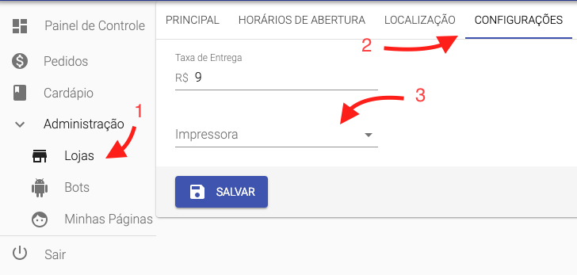

# Página de Downloads do Pizzaibot

Aqui estão os arquivos necessários para conectar o seu Whatsapp Web ao Pizzaibot e também para imprimir os pedidos em impressora térmica através do site.

## Whatsapp Web

Baixe [aqui](https://drive.google.com/open?id=1JDzx53_jJ-Z-fVgdJBLB6xiU4cSYfTmp) o Whatsapp Web do Pizzaibot

Após instalar o Whatsapp Web do Pizzaibot, você deverá conectar o celular ao Whatsapp Web baixado. Assim, o sistema poderá responder as mensagens automaticamente.

## Impressora

Baixe [aqui](https://drive.google.com/open?id=1nC4RBwgBifTnvQURWSywd1deZyolQVno) o programa para conectar a impressora

Esse programa vai instalar o sistema QZTray, que faz a conexâo do Pizzaibot com a sua impressora térmica. Após instalado, você poderá configurar a sua impressora no sistema:

